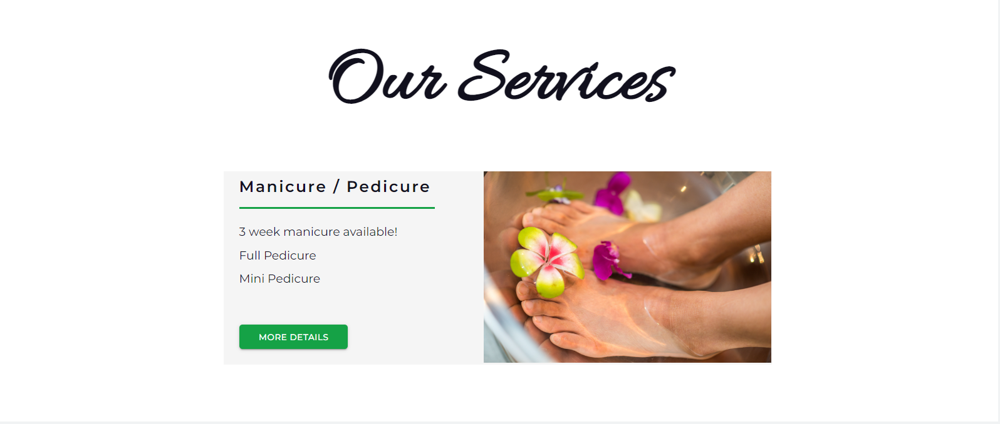
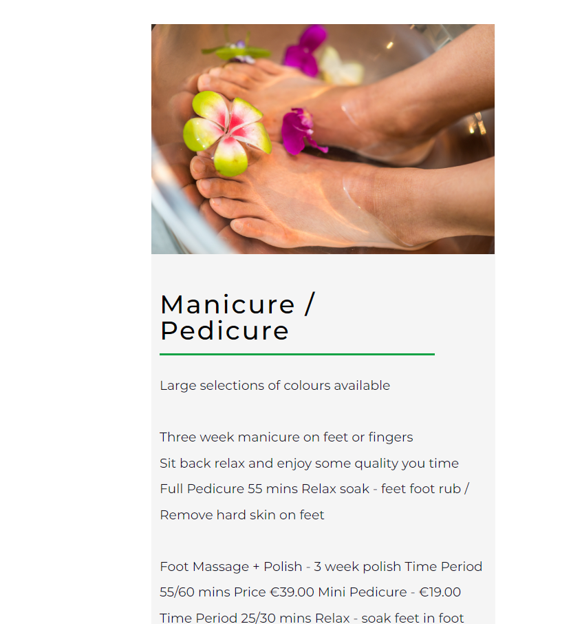
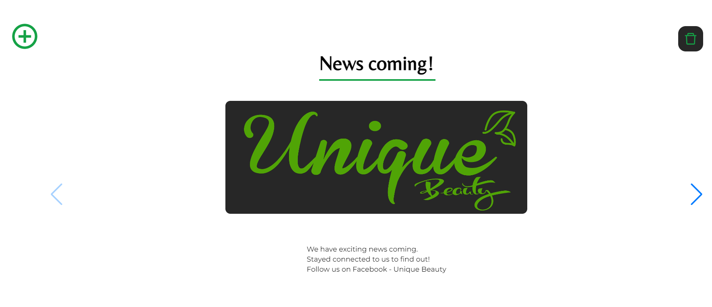
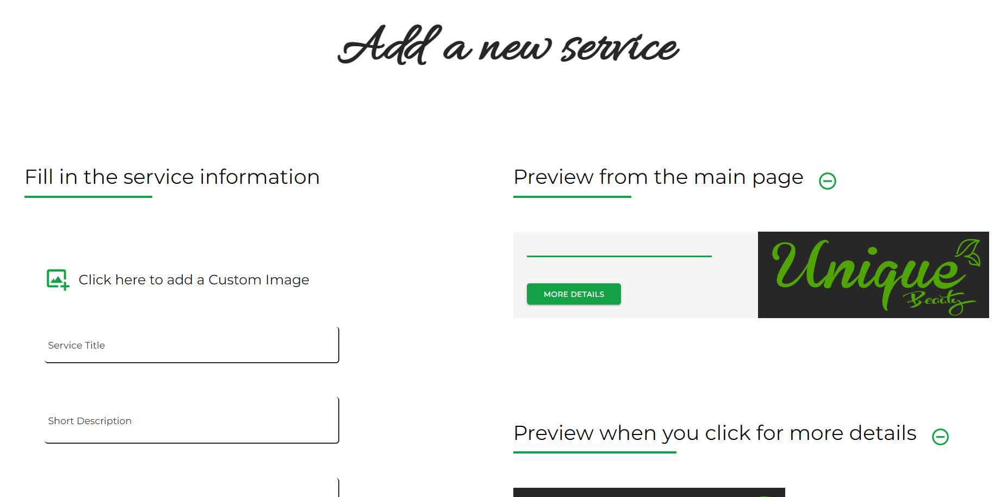
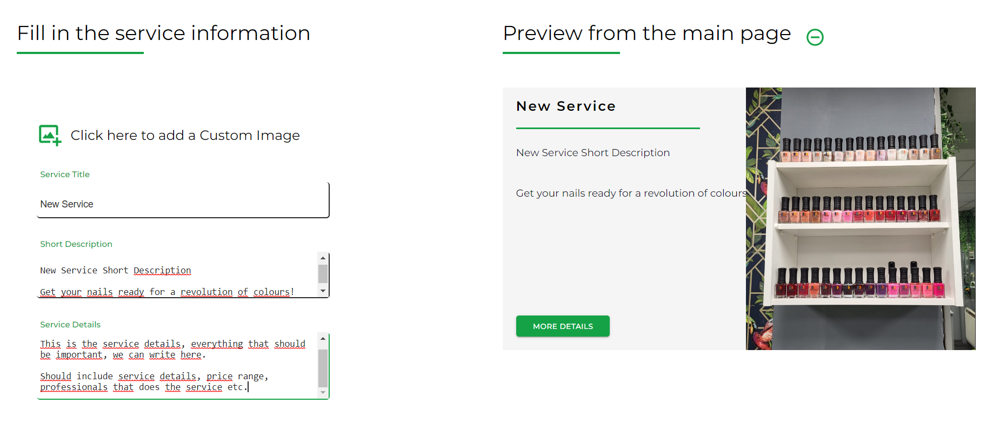
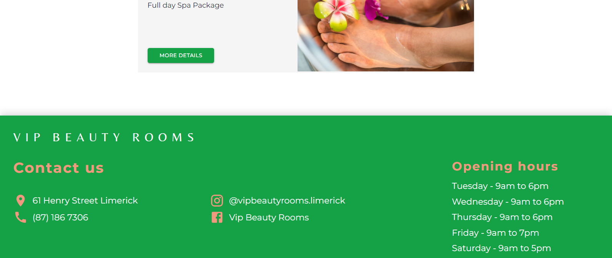
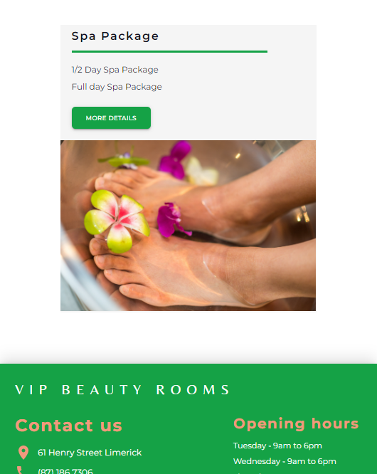
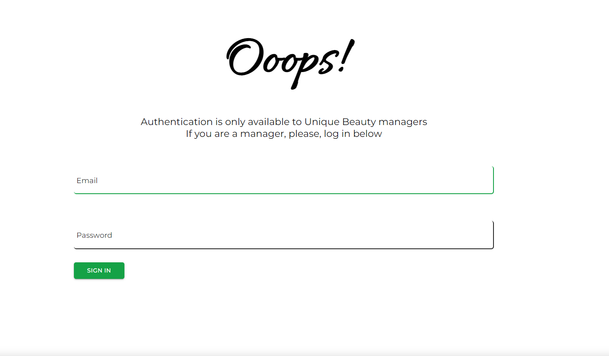
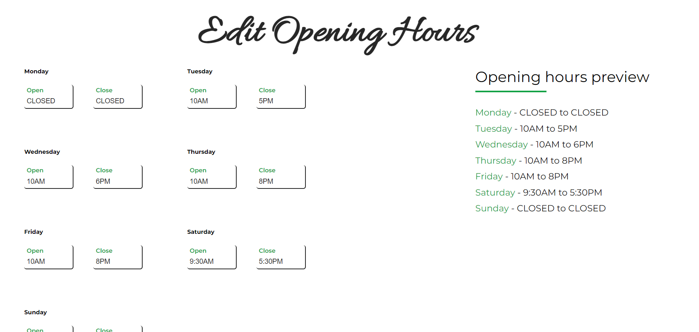

# VIP Beauty Rooms
Informative website for the Beauty Salon, located on 61 Henry Street, Limerick, Ireland.
https://uniquebeauty-limerick.com
 
 
 

## Project Overview

This App contains an authentication system, only for managers. Users cannot create an account and should not have access to credentials.

An authenticated manager can edit the store opening hours, add/edit/delete services the store offers and add/edit/delete posts, with the latest news.

 
 
 

### Services

A service is beauty procedure done by one of the store's professional. This can be, for examaple, a pack of massages or the manicure service.

On the Web App, a service can be clicked to display more detailed information.

<b>Service Card</b>

<b>Service clicked for more information</b>

 
 
 

### Posts

Posts are the way to share the latest news with the client.

The post format is inspired on the traditional social medias posts, where the information can be provided via image and text.

Posts are displayed inside a carousel, that is also responsive for small screen devices.

<b>Posts Carousel</b>

 
 
 

### Database and State Management

A database was added to the project, using <b>Firebase</b>. All services, posts and opening hours are saved on the Firestore database and fetched when required.

After information is fetched from the database, it is stored on the app using <b>Redux.js</b>. This enables user to change website route and preserve the same state. For example, when a manager sign-in, this state is going to continue on different pages routes, while on the session.

 
 
 

### Manager Authentication

Store managers are able to edit all kind of website information. This is a huge step to give managers power to customize and update the web app, without the need of a developer to be involved.

Manager authentication features:

<ul>
    <li>uses Firebase Authentication</li>
    <li>enables authenticated users to edit/add/deleted services, posts and opening hours</li>
    <li>exclusive pages, only for authenticated users</li>
</ul>
 
 
<b>Add Service page for managers</b>

 
 

<b>Add Service page with filled fields</b>

Pages to add/edit a service/post/opening hours has a preview system, that automatically updates on user input.

 
 
 

## Pages and Screens

<b>Footer</b>

 
 
 
<b>Service details page</b>

 
 
 
<b>Responsive card design for smaller screens</b>

 
 
 
<b>Login Page</b>

 
 
 
<b>Routes for managers</b>

 
 
 
<b>Opening hours edit page</b>

 
 
 

## Technical information

<ul>
    <li>Built with React.js, Sass, Redux.js, Firebase</li>
    <li>Others libs includes React Icons, React Responsive, Material UI and Swiper</li>
    <li>Responsive design for smaller devices</li>
    <li>Design made by the author, following client needs</li>
</ul>